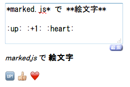

# example/gemoji.js

## Build

```
sudo npm install -g browserify
npm install string.prototype.codepointat --save
wget -O src/emoji.json https://raw.githubusercontent.com/github/gemoji/master/db/emoji.json
node build.js
browserify lib/*.js -o dist/gemoji.js --standalone gemoji
```

## Demo

- https://rawgit.com/ngyuki/example-marked-gemoji.js/master/example/index.html

## Screenshot


